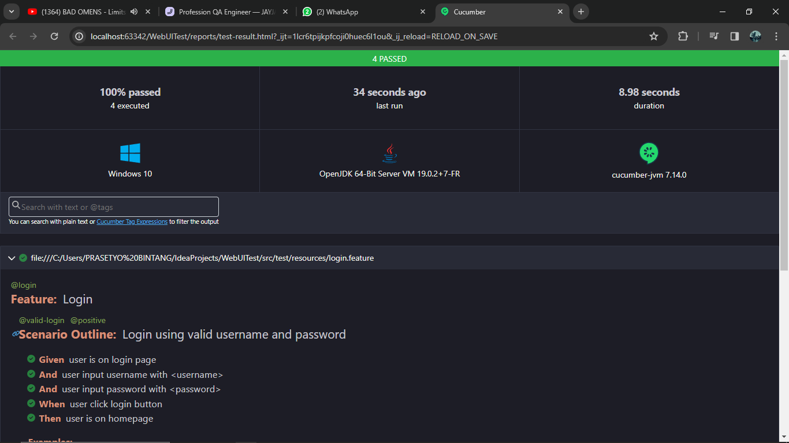

# Web UI Test

Buat kerangka pengujian UI Web menggunakan Cucumber, Java, Gradle, Selenium

Untuk menyelesaikan tugas ini, Anda perlu melakukan hal berikut:

Buat proyek Gradle dan konfigurasikan dependensi yang diperlukan seperti Cucumber, Selenium, dan JUnit.

Terapkan pola Model Objek Halaman, di mana setiap halaman web dari aplikasi yang diuji direpresentasikan sebagai kelas Java yang terpisah. Kelas ini akan berisi semua pencari lokasi dan metode yang diperlukan untuk berinteraksi dengan elemen di halaman tersebut.

Tulis kasus uji menggunakan Gherkin syntax, yang merupakan format bahasa alami untuk menggambarkan tes. Kasus uji harus menjelaskan perilaku yang diharapkan dari aplikasi dalam hal fitur dan persyaratannya.

Gunakan Cucumber library untuk mendukung kasus pengujian Gherkin, menjalankannya, dan membuat laporan.

Buat rangkaian pengujian otomatis yang mencakup tests positif (positive), negatif (negative), dan batas (boundaries). Pengujian ini harus memverifikasi fungsionalitas aplikasi, memeriksa apakah aplikasi berperilaku seperti yang diharapkan dalam skenario yang berbeda.

Kirimkan tugas sebagai repositori GitHub dengan file README yang tepat yang menjelaskan tujuan proyek dan cara menjalankan pengujian. README juga harus menyertakan informasi yang relevan tentang penyiapan dan konfigurasi proyek.
